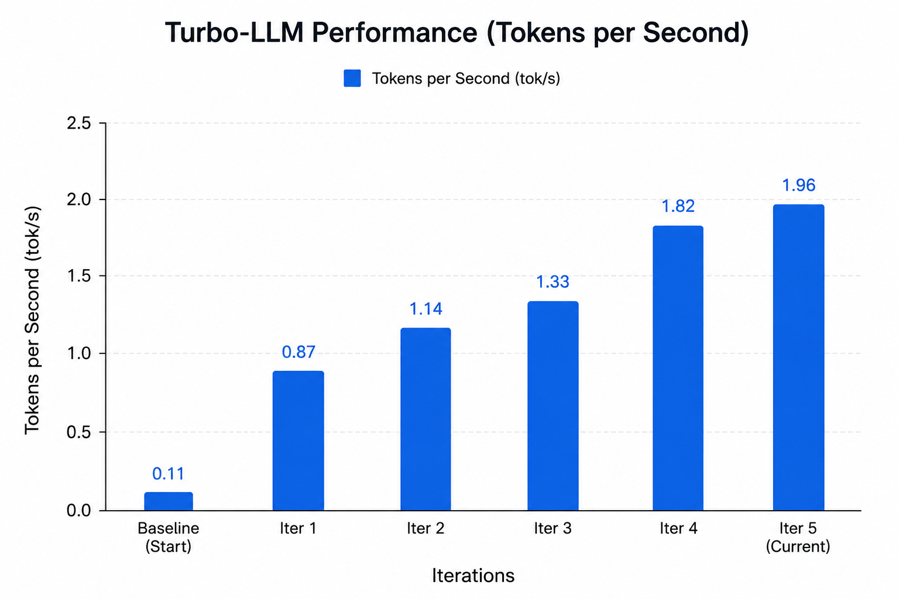

<p align="center">
  
</p>

<h1 align="center">Turbo-LLM</h1>

<p align="center">
Fast Memory-Efficient Inference Engine for Large MoE Models
</p>

<p align="center">
🚀 ~18× Faster Than Initial Prototype • 🧠 30B MoE on ~6GB VRAM • ⚡ ~2 tok/s Warm Decode
</p>

---

## Turbo-LLM

Turbo-LLM is an experimental inference engine designed to run large language models under strict VRAM limits using dynamic expert execution and adaptive GPU residency.

Instead of loading the full model into memory, Turbo-LLM executes only the required components during generation.

Current architecture focuses on:

* Dynamic expert routing
* Sequential MoE execution
* Adaptive expert caching
* Layer streaming
* KV cache generation
* Low VRAM inference

Current tested configuration:

```text
Ram:
16 GB

Model:
Qwen3-30B-A3B-Instruct-FP8

GPU:
RTX 3050 6GB

Peak VRAM:
~5.3GB
```

---

## Benchmark

<p align="center">
  
</p>

### Throughput Evolution

| Version             | Tokens/sec |
| ------------------- | ---------: |
| Baseline            |       0.11 |
| Prefetch + Cache    |       0.87 |
| Decode Optimization |       1.14 |
| Static Buffers      |       1.33 |
| Active pinning      |       1.96 |
| Current             |       1.96 |
| Warm Cache          |       2.22 |

Latest long generation benchmark:

```text
Prompt:
Generate ~500 words

Output:
500 tokens

Total Runtime:
255.1 sec

Speed:
1.96 tok/s

Peak VRAM:
5.31 GB

```

---

## Repository Structure

```text
Turbo-LLM/

assets/
├── logo.png
├── benchmark.png

loader/
├── expert_loader.py

execution/
├── router.py
├── moe.py
├── layer_executor.py

cache/
├── kv_cache.py

benchmark/

phase1_probe.py
phase2_generate.py
README.md
```

---

## Testing

Architecture probe:

```bash
python phase1_probe.py
```

Generation & Benchmark :

```bash
python phase2_generate.py
```


---

## Features

* Sequential MoE execution
* Dynamic expert routing
* KV cache
* Adaptive expert residency
* Static GPU buffers
* Warm decode acceleration

---

## Roadmap

* [x] Sequential execution
* [x] Dynamic expert loading
* [x] Adaptive residency
* [x] Static GPU buffers
* [ ] CUDA Graph
* [ ] Kernel fusion
* [ ] 3–5 tok/s target

---

## Contributing

Ideas, benchmarks and pull requests are welcome.

If you find this useful:

⭐ Star the repository
